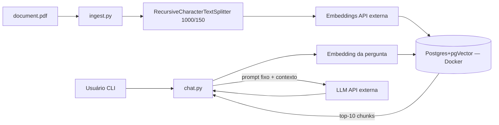

# 01 — Análise inicial (desafio1)

Data: 2026-09-04. Modo: estático/offline. Fonte primária: enunciado do desafio.

## 1. O que o desafio pede (reconstrução fiel)

Software em **Python + LangChain** com duas capacidades:

1. **Ingestão**: ler `./document.pdf` → dividir em chunks de **1000 caracteres, overlap 150** (`RecursiveCharacterTextSplitter`) → embedding por chunk → persistir em **PostgreSQL + pgVector** (`langchain_postgres.PGVector`) subindo via **Docker Compose**.
2. **Busca/CLI**: script de chat no terminal que vetoriza a pergunta, busca `similarity_search_with_score(k=10)`, monta o **prompt fixo do enunciado** (contexto + regras + 3 exemplos de recusa) e responde via LLM — recusando com a frase exata quando fora de contexto: `"Não tenho informações necessárias para responder sua pergunta."`

Estrutura obrigatória: `docker-compose.yml`, `requirements.txt`, `.env.example`, `src/ingest.py`, `src/search.py`, `src/chat.py`, `document.pdf`, `README.md`. Entregável: **repo público no GitHub**.

## 2. Características do projeto

- **Greenfield**: sem codebase, sem git, sem template (INC-01), sem PDF (INC-02).
- **Stack fixa e pequena**: 3 scripts + 1 compose. Complexidade está em contratos (env, provider, pgvector) e provas, não em volume.
- **Dependências externas live**: OpenAI e/ou Google (embeddings + LLM) e Docker local. Toda prova live tem **custo/cota** — testes automatizados devem usar doubles (RNF-QA-01).
- **Ambiente Windows**: enunciado é Unix-centric (INC-05); execução real será em PowerShell.

## 3. Riscos prioritários (viram requisitos/gates)

| Prio | Risco | Mitigação |
| --- | --- | --- |
| P0 | Enviar PDF com dado sensível a API externa sem decisão de compliance (a **ingestão já envia todo o PDF** à API de embeddings) | DEC-07 + RNF-PRV-01 antes de qualquer ingestão live |
| P0 | Vazamento de API key (commit de `.env`) | RNF-SEC-01 + gate de segredos no review |
| P0 | Resposta inventada fora de contexto (sem threshold — INC-10) | prompt fixo RF-QRY-04 + teste de fallback RF-QRY-05 |
| P1 | Provider ambíguo quebra schema (dims 1536 vs 768 — INC-03/08) | DEC-01 antes de codar; coleção por provider |
| P1 | Ambiente não pronto (Python ausente, daemon parado) | instalação autorizada + reexecutar pre-flight |
| P1 | Modelos citados indisponíveis na data (INC-07) | verificar fonte oficial na Fase B; fallback de modelo registrado em DEC-01 |
| P2 | Reexecução duplica vetores (INC-09) | DEC-06 |
| P2 | Cota free-tier estourada durante desenvolvimento | doubles em testes; poucos runs live; k=10 limita tokens |

## 4. Topologia esperada (para o TDD)

Trust boundaries: host↔Docker (local), app↔API OpenAI/Google (internet). Detalhes em [09-THREAT-MODEL.md](09-THREAT-MODEL.md).

## 5. Conclusão da análise

Desafio **pequeno e bem especificado**, com 14 inconsistências/lacunas (INC-01..14), sendo 3 bloqueantes de material: template (INC-01), PDF (INC-02) e provider (INC-03). Recomendação: **GO COM RISCOS** para preparação (concluída neste pacote) e **NO-GO para implementação** até fechar DEC-01/02/03/07 e instalar Python + subir Docker daemon.

## 6. Limitações

- Análise estática do enunciado; nenhum código, doc oficial de modelos ou template real foi consultado.
- Números de cota/preço de APIs: NÃO FOI POSSÍVEL DETERMINAR sem fonte oficial datada.
